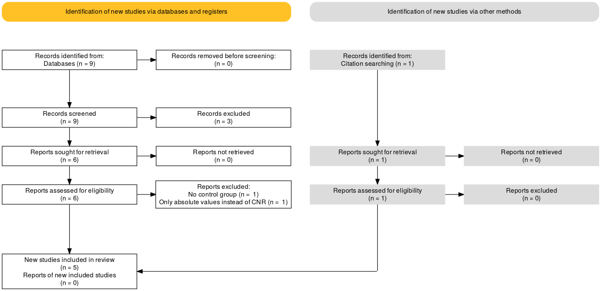

```{r packages, include=FALSE}
rm(list = ls()) 

knitr::opts_chunk$set(echo = TRUE)
knitr::opts_knit$set(global.par = TRUE)
# numbers >= 10^5 will be denoted in scientific notation,
## and rounded to 2 digits
options(scipen = 1, digits = 2)
f_pvalue = function(p.value, symbol = "="){
  p.value <- round(p.value, digits = 3)
  if (p.value == 0) {
    return("p < .001")
  } else {
    return(paste0("p", symbol, round(p.value, digits = 3)))
  }
}

# install all packages if not done yet
  
if (!require(readxl)) install.packages("readxl")
if (!require(tidyverse)) install.packages("tidyverse")
if (!require(meta)) install.packages("meta")
if (!require(metafor)) install.packages("metafor")
if (!require(dmetar)) install.packages("dmetar")
if (!require(papaja)) install.packages("papaja")
if (!require(kableExtra)) install.packages("kableExtra")
if (!require(reshape2)) install.packages("reshape2")
if (!require(nlme)) install.packages("nlme")


# load all necessary packages
    
library(readxl)
library(tidyverse)
library(meta)
library(metafor)
library(dmetar)
library(readr)
library(papaja)
library(kableExtra)
library(reshape2)
library(nlme)


```


```{r dataimport, include=F}
#load data
#data_qmri<-read_excel("Literatur_uebersicht.xlsx") # this did not recognize comma as decimal seps
file <- "/cloud/project/data/Literatur_uebersicht.csv"
data_qmri <- read.csv2(file, header = TRUE, sep = ",", quote = "\"", dec = ",", fill = TRUE,na.strings = "NA")

# still displays decimals and turn relevant columns into numerics
options(digits=5)
data_qmri[,14:33] <- sapply(data_qmri[,14:33],as.numeric)
data_qmri[,4] <- sapply(data_qmri[,4],as.numeric)


#data_qmri <- read_delim("data/Literatur_uebersicht.csv", ";", escape_double = FALSE, trim_ws = TRUE)

authors <- c("Watanabe (2014)","Cassidy (2019)-SCZ","Cassidy (2019)-CHR", "Shibata (2008)","Sasaki (2010)","Jalles (2020)")


# calculate mean age of both groups for both datasets
data_qmri_cr <- data_qmri %>% rowwise() %>% mutate(age_mean=mean(c(age_HC, age_SZ)))

```


```{r sumtable, include=T,echo=F}

# sumtable = subset(data_qmri, select = c('Autor','sample','sequence','region.of.interest','ROI.tracing.method','scanner.type'))
# 
# 
# options(knitr.kable.NA = "")
# # then print it in a table using the kable command
# 
# kable(
#   sumtable,
#   caption = "**Summary of Characteristics of Synthesized NM-MRI Studies**",
#   col.names = c("Study label","MR-Sequence","Scanner Type","Reference region","Age of onset, Mean (SD)","ROI tracing")
# ) %>%
#   kable_styling("striped") %>%
#   footnote("GRE=gradient response echo, FSE=fast spin echo, SPGR= spoiled gradient-recalled, SCP=superior cerebellar peduncle, ROI=region of interest, TE=time to echo, TR=time to repetition, SCZ=schizophenic patients, CHR=clinical high-risk individuals, HC=healthy controls, MDD=major depressive disorder", general_title = "Demographic and neuropsychological data")
# #####
# 

```


### Methods

#### Study Selection

This review was completed according to PRISMA (Preferred Reporting Items for Systematic Reviews and Meta-Analyses) guidelines [@Moher2009]. Inclusion criteria and methods for analyses were prespecified and documented in a preregistered protocol {r} [https://osf.io/fykum] on January 6, 2021, publically available on the OSF (Open Science Framework). PubMed was searched from inception to January 6, 2021, according to the following search algorithm: ("neuromelanin" OR "qMRI" OR "hMRI") AND (MRI)) AND ("schizophrenia" OR "schizophrenic" OR "psychosis"). A total of 9 entries on PubMed and 2 additional studies, known to the authors were screened. Studies were included according to the following criteria: (1) case-control studies including patients with a schizophreniform disorder, (2) NM-MRI sequences were used and (3) if they contained sufficient information on the contrast-to-noise ratio. Studies or subsets of studies were excluded in the following case: (1) other patient populations, (2) study designs only comparing patients without healthy controls, (3) articles focussing on the validation of NM-MRI sequences in non-patient samples. 6 studies were found to be eligible.


```{r fig2, echo = FALSE, out.width = "100%", fig.cap = "Flowchart: Study extraction"}





```

#### Quality assessment 

The methodological quality of all eligible studies was evaluated using the Newcastle– Ottawa Scale (NOS) for assessing the quality of non-randomized studies in meta-analysis [@Wells2014]. 
### Data synthesis

#### Meta-analysis

Novelty of the method and scarcety of eligible studies prevented an a priori estimate of heterogeneity. Therefore, a random-effects, as well as a fixed-effects model were calculated and compared. Hedge's g and DerSimonian-Laird estimator for &tau; were used for calculating pooled effect sizes while taking variance into account. Since there were only 6 studies available in total, no subgroup analyses were conducted, according to the standard criterion [@Borenstein2013].

#### Meta-regression

Meta-regression analyses for publication year and mean age across both groups was calculated to estimate the effect of moderating variables on effect sizes between studies. Hedge's g and DerSimonian-Laird estimator for &tau; were used for calculating pooled effect sizes while taking variance into account.

The statistical software R (version 3.6.3; R Foundation for Statistical Computing, Vienna, Austria) with the meta package (insert package citation) for meta-analysis of effect size and with the metafor package (insert package citation) for meta-analysis of variance was used to analyse all data.

```{r recomputeYamashita, include=F}

# calculate sd from interquartil range
# assuming that data is normally distributed mean = median
# https://stats.stackexchange.com/questions/256456/how-to-calculate-mean-and-standard-deviation-from-median-and-quartiles

# first for HC
q1 <- data_qmri$HCmean[5] - data_qmri$HCsd[5]/2
q3 <- data_qmri$HCmean[5] + data_qmri$HCsd[5]/2
n <- data_qmri$HCn[5]

# replace in qMRI
data_qmri$HCsd[5] <- (q3 - q1) / (2 * (qnorm((0.75 * n - 0.125) / (n + 0.25))))

# then for SZ
q1 <- data_qmri$SZmean[5] - data_qmri$SZsd[5]/2
q3 <- data_qmri$SZmean[5] + data_qmri$SZsd[5]/2
n <- data_qmri$SZn[5]

# replace in qMRI
data_qmri$SZsd[5] <- (q3 - q1) / (2 * (qnorm((0.75 * n - 0.125) / (n + 0.25))))
```

### Results 

```{r resul_cr, fig.height = 6, fig.width = 12, include=T,echo=F}
resul_cr<- metacont(SZn, SZmean, SZsd, HCn, HCmean, HCsd, data = data_qmri_cr, sm="SMD", method.smd = "Hedges", studlab = Autor)
print(resul_cr)


pdf("/cloud/project/plots/Fig2_Forest_SN.pdf", width=12, height=5) 
forest(resul_cr, col.square = "lightblue", col.diamond = "darkblue", col.diamond.lines = "darkblue", lab.e = "Patients with schizophrenia", lab.c = "Healthy controls")
dev.off() 


# filter for studies without CNR-LC and do it again
data_qmri_cr_LC <- data_qmri_cr %>% filter(year!="2019") %>% filter(year!="2020")
  
resul_cr_LC <- metacont(SZn, SZmean_LC, SZsd_LC, HCn, HCmean_LC, HCsd_LC, data = data_qmri_cr_LC, sm="SMD", method.smd = "Hedges", studlab = Autor)
print(resul_cr_LC)

pdf("/cloud/project/plots/Suppl_Fig5_Forest_LC.pdf", width=12, height=5) 
forest(resul_cr_LC, col.square = "lightblue", col.diamond = "darkblue", col.diamond.lines = "darkblue", lab.e = "Patients with schizophrenia", lab.c = "Healthy controls")

dev.off() 

```

The fixed effects model suggests significant differences between between patients and controls in mean estimates for neuromelanine content in the substantia nigra (SN) (d=``r resul_cr$TE.fixed``[``r resul_cr$lower.fixed``; ``r resul_cr$upper.fixed``], z=``r resul_cr$zval.fixed``, p=``r resul_cr$pval.fixed``, see Figure 2) and no significant differences in mean estimates for neuromelanine in the locus coeruleus (d=``r resul_cr_LC$TE.fixed``[``r resul_cr_LC$lower.fixed``; ``r resul_cr_LC$upper.fixed``], z=``r resul_cr_LC$zval.fixed``, p=``r resul_cr_LC$pval.fixed``, see eFigure 5)

The random effects model revealed a significant difference between patients and controls in mean estimates for the substantia nigra (d=``r resul_cr$TE.random``[``r resul_cr$lower.random``; ``r resul_cr$upper.random``], z=``r resul_cr$zval.random``, p=``r resul_cr$pval.random``, see Figure 2) and no significant difference for neuromelanine in the locus coeruleus (d=``r resul_cr_LC$TE.random``[``r resul_cr_LC$lower.random``; ``r resul_cr_LC$upper.random``], z=``r resul_cr_LC$zval.random``, p=``r resul_cr_LC$pval.random``, see eFigure 5)

The test for heterogeneity between studies shows a low amount of heterogeneity for CNR in the substantia nigra ($\tau^2$=``r resul_cr$tau^2``, $I^2$=``r resul_cr$I2*100``%), as well as the locus coeruleus ($\tau^2$=``r resul_cr_LC$tau^2``, $I^2$=``r resul_cr_LC$I2*100``%)  according to established standards [@Higgins2002].

### Funnel Plot Asymmetry

Visual inspection and formal testing for bias according to [@Egger1997] revealed no significant source of bias

```{r resul_metabias, include=T,echo=F}
resul_metabias<-regtest(x=resul_cr$TE, sei=resul_cr$seTE, model="lm") # "sei" for the standard error
print(resul_metabias)


pdf("/cloud/project/plots/Suppl_Figure2_FunnelPlot.pdf", width=12, height=12) 

# draw a funnel plot 
funnel(resul_cr, legend=TRUE)

dev.off() 

# with missing studies filled in, in our case none
resul_trimfill<-trimfill(resul_cr)
funnel(resul_trimfill, legend=TRUE)

#Studies are defined as outliers when their 95% confidence interval lies ouside the 95% confidence interval of the pooled effects
find.outliers(resul_cr)

resul_LC_metabias<-regtest(x=resul_cr_LC$TE, sei=resul_cr_LC$seTE, model="lm") # "sei" for the standard error
print(resul_LC_metabias)

# draw a funnel plot with missing studies filled in, in our case none
resul_trimfill<-trimfill(resul_cr_LC)
funnel(resul_trimfill, legend=TRUE)

#Studies are defined as outliers when their 95% confidence interval lies ouside the 95% confidence interval of the pooled effects
find.outliers(resul_cr_LC)

```


### Meta-regression

```{r metareg, include=T, echo=F}
# 
# # for year of publication and age (substantia nigra)
# resul_metareg_y<-metareg(resul_cr, year)
# resul_metareg_y
# resul_metareg_a<-metareg(resul_cr, age_mean)
# resul_metareg_a
# 
# # for year of publication and age (locus coeruleus)
# resul_LC_metareg_y<-metareg(resul_cr_LC, year)
# resul_LC_metareg_y
# resul_LC_metareg_a<-metareg(resul_cr_LC, age_mean)
# resul_LC_metareg_a
# 
# # for medication (chlorpromazine equivalent)
# resul_metareg_m<-metareg(resul_cr,Meds..CPZeq.)
# resul_metareg_m

# here age difference in a metareg does not make sense since we have a matched sample and differences should be 0
# only thing that would make sense as a metaregression: interaction of age (across all studies) with group and outcome ES

# does strength of already found effect in each group between age and CR differ between groups? (this analysis also controls for correct matching)
# lm: CR = age*group -> interaction significant? OR t-test between correlation coefficients

# reshape data into long format
# longdat.qmri <- melt(data_qmri_cr,
#                            # ID variables - all the variables to keep but not split apart on
#                            id.vars=c("Autor","age_mean"),
#                            # The source columns
#                            measure.vars=c("HCmean","SZmean"),
#                            # Name of the destination column that will identify the original
#                            # column that the measurement came from
#                            variable.name="group",
#                            value.name="CR"
# )


#mod <- lmer(CR~(1|Autor)*age_mean*group, data=longdat.qmri)


# pdf("/cloud/project/plots/Suppl_Figure4_BubblePlot_Year.pdf", width=12, height=12) 
# 
# # draw a funnel plot 
# bubble.y <- bubble(metareg(resul_cr, year),xlim = c(2005,2025), ylim=c(-0.9,1), bg = "transparent", ylab = "effect size", xlab="year of publication", cex.lab=1.5, lty = 1,
#        lwd = 1,
#        col.line = "blue", regline = TRUE, studlab = TRUE, pos.studlab = 1, offset = 1)
# bubble.y 
# 
# dev.off() 
# 
# pdf("/cloud/project/plots/Suppl_Figure5_BubblePlot_Age.pdf", width=12, height=12) 
# 
# 
# bubble.a <- bubble(metareg(resul_cr, age_mean),xlim = c(15,50),ylim=c(-0.2,0.7), bg = "transparent", ylab = "effect size", xlab="age", cex.lab=1.5, lty = 1,
#        lwd = 1,
#        col.line = "blue", regline = TRUE, studlab = TRUE, pos.studlab = 1, offset = 1)
# bubble.a 
# 
# dev.off() 

# To control for possible further sources of variance, we conducted random-effects meta-regression. Publication year showed no significant moderating effect (QM=``r resul_metareg_y$QM``, p=``r resul_metareg_y$pval[2]``, see eFigure 7). Age of the investigated subjects did also show no significant moderating effect QM=``r resul_metareg_a$QM``, p=``r resul_metareg_a$pval[2]`` see eFigure 8). Antipsychotic medication of the investigated subjects did also show no significant moderating effect QM=``r resul_metareg_m$QM``, p=``r resul_metareg_m$pval[2]``.


```


# Meta-analysis of variance ratio

```{r meta_vr_cvr, include=F}

var_ratio<-data_qmri%>%
  escalc("VR", n1i=SZn, m1i=SZmean, sd1i=SZsd, n2i=HCn, m2i=HCmean, sd2i=HCsd, data=., append = T)
resul_var_ratio<-rma.uni(var_ratio, measure = "VR", slab=data_qmri$Autor)

sum_var_ratio<-summary(var_ratio)
resul_var_ratio<-rma.uni(var_ratio, measure = "VR", slab=data_qmri$Autor)

cvar_ratio<-data_qmri%>%
  escalc("CVR", n1i=SZn, m1i=SZmean, sd1i=SZsd, n2i=HCn, m2i=HCmean, sd2i=HCsd, data=., append = T)
resul_cvar_ratio<-rma.uni(cvar_ratio, measure = "CVR")
resul_cvar_ratio

# double-check by computing manually
log(data_qmri$SZsd/data_qmri$HCsd)+((1/((2*data_qmri$SZn)-1))-(1/((2*data_qmri$HCn)-1)))

pdf("/cloud/project/plots/Suppl_Figure6_VR.pdf", width=10, height=6) 
# 2. Create a plot
forest_plot <- forest.rma(resul_var_ratio, slab=data_qmri$Autor, showweights=TRUE, top=2)
text(forest_plot[["xlim"]][1]-0.2,length(forest_plot[["rows"]])+2, "Study", pos=4)
text(forest_plot[["xlim"]][2]-1.4,length(forest_plot[["rows"]])+2,"Weight", pos=2)
text(forest_plot[["xlim"]][2]+0.3,length(forest_plot[["rows"]])+2, "Log VR [95% CI]", pos=2)
text(-1.9,-1.6,"greater variability in controls")
text(1.9,-1.6,"greater variability in patients")
### add text with Q-value, dfs, p-value, and I^2 statistic
text(forest_plot[["xlim"]][1]+1, -1, pos=4, cex=0.9, bquote(paste("(Q = ",.(formatC(resul_var_ratio$QE, digits=2, format="f")), ", df = ", .(resul_var_ratio$k - resul_var_ratio$p),", p = ", .(formatC(resul_var_ratio$QEp, digits=2, format="f")), "; ", I^2, " = ",.(formatC(resul_var_ratio$I2, digits=1, format="f")), "%)")))

# Close the pdf file
dev.off()

resul_var_ratio<-rma.uni(var_ratio, measure = "VR", slab=data_qmri$Autor)

resul_cvar_ratio<-rma.uni(cvar_ratio, measure = "CVR", slab=data_qmri_cr$Autor)

pdf("/cloud/project/plots/Suppl_Figure7_CVR.pdf", width=10, height=6) 

forest_plot <- forest.rma(resul_cvar_ratio, slab=data_qmri_cr$Autor, showweights=TRUE, top=2)
text(forest_plot[["xlim"]][1],length(forest_plot[["rows"]])+2, "Study", pos=4)
text(forest_plot[["xlim"]][2]-2.5,length(forest_plot[["rows"]])+2,"Weight", pos=4)
text(forest_plot[["xlim"]][2],length(forest_plot[["rows"]])+2, "Log CVR [95% CI]", pos=2)
text(-2.4,-1.6,"greater variability in controls")
text(2.4,-1.6,"greater variability in patients")
### add text with Q-value, dfs, p-value, and I^2 statistic
text(forest_plot[["xlim"]][1]+1, -1, pos=4, cex=0.9, bquote(paste("(Q = ",.(formatC(resul_cvar_ratio$QE, digits=2, format="f")), ", df = ", .(resul_cvar_ratio$k - resul_cvar_ratio$p),", p = ", .(formatC(resul_cvar_ratio$QEp, digits=2, format="f")), "; ", I^2, " = ",.(formatC(resul_cvar_ratio$I2, digits=1, format="f")), "%)")))


dev.off() 


```

Taking possible effects of mean differences into account, we calculated coefficient of variation ratio. The adjusted measure shows no significant difference (logCVR=``r resul_cvar_ratio$beta[1]`` [``r resul_cvar_ratio$ci.lb``;``r resul_cvar_ratio$ci.ub``]; z=``r resul_cvar_ratio$zval``; p=``r resul_cvar_ratio$pval``, see Figure x) across all studies. The calculation of a random-effects model for differences in variability ratio also revealed no significant effect in patients as compared to controls (logVR=``r resul_var_ratio$beta[1]`` [``r resul_var_ratio$ci.lb``;``r resul_var_ratio$ci.ub``]; z=``r resul_var_ratio$zval``; p=``r resul_var_ratio$pval``, see eFigure x). 

### Post-hoc Power Analysis
```{r power-analysis, include=T, echo = F}

# this gives us power slightly below 0.8 (only if excluding Yamashita)
pa_cr <- power.analysis(d = resul_cr$TE.random, k = 6, n1 =mean(data_qmri_cr$HCn), n2 = mean(data_qmri_cr$SZn), heterogeneity = "moderate")
pa_cr

```


Post-hoc power analysis revealed a power of ``r pa_cr$Power``.

### References